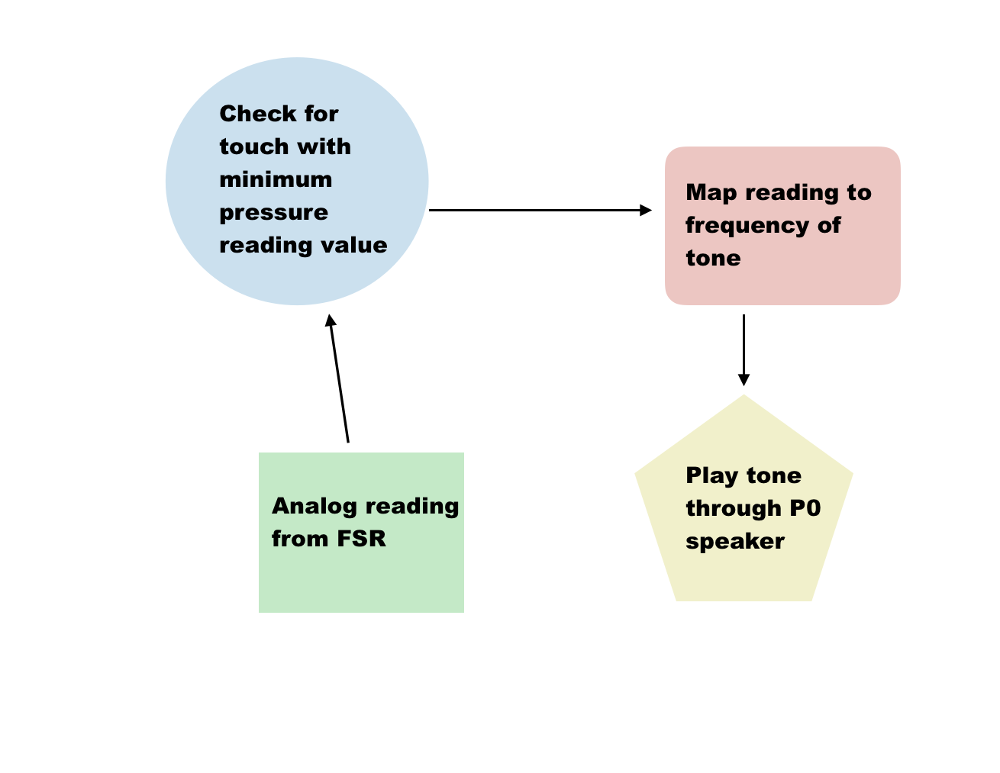
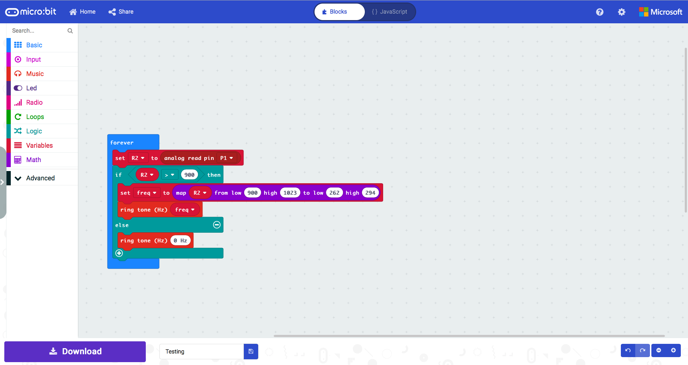
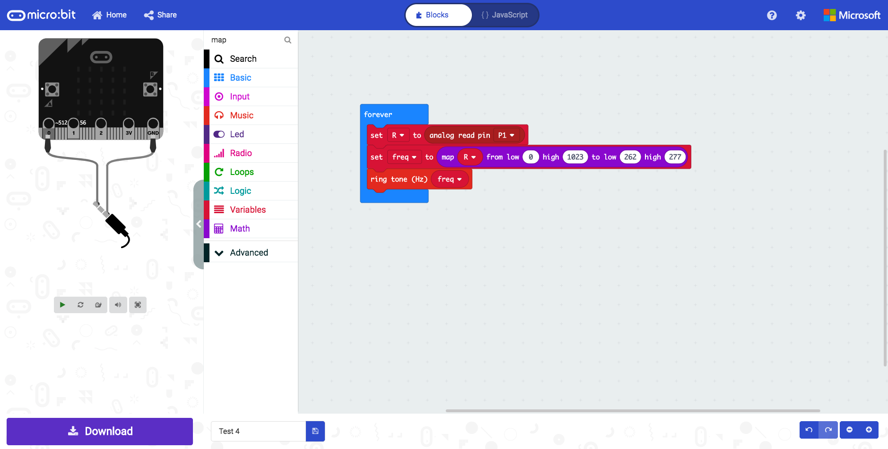

# Assessment 1: Replication project

*Markdown reference:* [https://guides.github.com/features/mastering-markdown/](http://guides.github.com/features/mastering-markdown/)

## FSR Ukulele ##

## Related projects ##
*Find about 6 related projects to the project you choose. A project might be related through  function, technology, materials, fabrication, concept, or code. Don't forget to place an image of the related project in the* `replicationproject` *folder and insert the filename in the appropriate places below. Copy the markdown block of code below for each project you are showing, updating the number* `1` *in the subtitle for each.*

### Related project 1 ###

Project: Micro:bit guitar

https://makecode.microbit.org/courses/csintro/arrays/project

This project is related to mine as it is also an example of a project that uses the micro:bit to play different tones when the guitar is held differently and tilted while playing. Although I would be using a different form of input the concept is similar wherein the the pitch and tone of the sounds are modulated based on the input from the user. The array of notes can be played when an input occurs, such as one of the buttons being pressed, or if one or more of the pins is activated.

### Related project 2 ###

Project: Micro:bit paper piano

https://drive.google.com/file/d/1dgUUIEMWrP4NXYAxSSu5Rrd2ygb8OVcj/view

This project is also related to mine as it is also type of musical instrument whereas in this project the keys are covered by tin foil. All the keys are connected to 3.3 Volt that is supplied by the 3V pin of the microbit. There are 3 strips of tin foil laying under the keys perpendicularly. Each strip is connected to a digital input pin on the microbit. When a key is pressed it connects 3V to the digital input through the tin foils. The way microbit can recognize the different keys is that every key can
contact to different combination of strips as we cover some of the strips with paper

### Related project 3 ###

Project: Micro:bit tilt thermin

http://www.suppertime.co.uk/blogmywiki/2019/02/microbit-music-experiments/

This project is also related to myine as it is also type of musical instrument, controlling the pitch of the tone being played by changing the physical pitch (tilt) of the micro:bit.

### Related project 4 ###

Project: Micro:bit light thermin

https://www.element14.com/community/community/stem-academy/microbit/blog/2018/12/21/project-bbc-microbit-light-theremin-by-cabe

This project is also related to myine as it is also type of musical instrument, controlling the pitch of the tone being played by changing the physical pitch (tilt) of the micro:bit.

## Reading reflections ##

### Reading: Don Norman, The Design of Everyday Things, Chapter 1 (The Psychopathology of Everyday Things) ###

*What I thought before: Never really understood the importance of feedback before but while working on this project where it was very helpfull in troubleshooting while prototyping. It actually lets you know how the user is interacting with the guitar.*

*What I learned: I learned that prequisite knowledge shapes the affordance of a technology, whereas in my projects's case the user usually already has an idea about how to play the guitar along the frett even though the technology behind the guitar works very differently.*

*What I would like to know more about: I would like to learn more about how a designer could make intuitive signifiers and find ways of mapping controls without misdirecting the user.*

*How this relates to the project I am working on: Like I mentioned previously affordances govern how we interact with any object or technology and in the casee of my guitar project I did not have the need to design and set-up a signifier to instruct the user on how the guitar worked. The inate idea of a guitar paved the path towards the user atomatically understanding how the technology worked.*

### Reading: Chapter 1 of Dan Saffer, Microinteractions: Designing with Details, Chapter 1 ###

*What I thought before: I've always looked to go big and tried playing with out of ordinary designs but through reading Dan Saffer's writing in this chapter, I understand that experimental designs are not always the best idea for the best end-user experience.*

*What I learned: I learnt that no matter how small or big a microinteraction model is, attension to detail is crucial as it is within these minor details that lies the secret to well-designed interaction models.*

*What I would like to know more about: Dan Saffer mentions that often times the attention of clients and stakeholders is focused on the big features instead of the small details that would enhance those features or improve the overall experience. I'd like know more on how a designer could tackle these situations while working professionaly*

*How this relates to the project I am working on: Multiple micro-interactions make up my project as a whole, I had to first figure out code to just sensing touch from the resistor and then add the detail of modulating the pitch based on pressure. Simple touch and pressure interaction triggers all of the events from my project*

### Reading: Scott Sullivan, Prototyping Interactive Objects ###

*What I thought before: Describe something that you thought or believed before you read the source that was challenged by the reading.*

*What I learned: Describe what you now know or believe as a result of the reading. Don't just describe the reading: write about what changed in YOUR knowledge.*

*What I would like to know more about: Describe or write a question about something that you would be interested in knowing more about.*

*How this relates to the project I am working on: Describe the connection between the ideas in the reading and one of your current projects or how ideas in the reading could be used to improve your project.*

## Interaction flowchart ##

## Process documentation

*Include screenshots of the code you have used.*

## Project outcome ##

### FSR Ukulele ###

### Project description ###

*This is a project replicating the idea of a guitar like musical instrument built with the microbit and a speaker. Notes are played according to the physical touch and pressure of the touch from the user on the instrument. The main purpose or use for this project would be educate children and beginners about the musical notes and pitch modulation in instruments.*

### Showcase image ###

*Try to capture the image as if it were in a portfolio, sales material, or project proposal. The project isn't likely to be something that finished, but practice making images that capture the project in that style.*

### Additional view ###

*Provide some other image that gives a viewer a different perspective on the project such as more about how it functions, the project in use, or something else.*

### Reflection ###

*Describe the parts of your project you felt were most successful and the parts that could have done with improvement, whether in terms of outcome, process, or understanding.*

*What techniques, approaches, skills, or information did you find useful from other sources (such as the related projects you identified earlier)?*

*What ideas have you read, heard, or seen that informed your thinking on this project? (Provide references.)*

*What might be an interesting extension of this project? In what other contexts might this project be used?*
